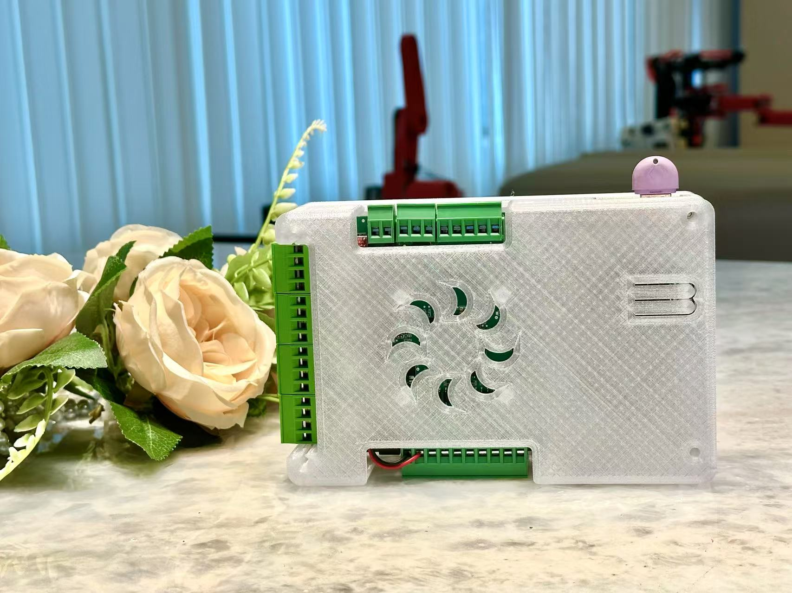
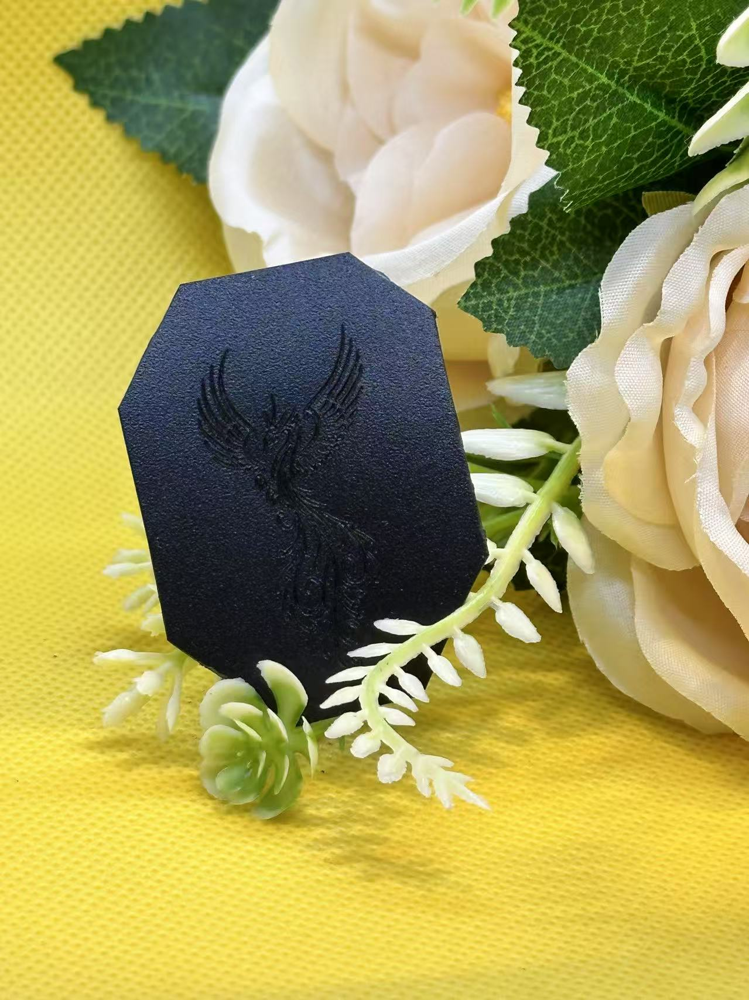

# 核心产品介绍

## 1. 控制器系列

### 1.1 联犀物联网控制器

联犀物联网控制器是一款高性能的物联网控制设备，专为智能设备控制和数据采集设计。

主要特点：
- 支持多种通信协议
- 内置丰富的IO接口
- 可编程逻辑控制
- 远程监控和管理

### 1.2 Y控制器

Y控制器是专为特定应用场景设计的控制器，具有高可靠性和稳定性。

主要特点：
- 紧凑型设计
- 低功耗运行
- 多种控制模式
- 易于集成

## 2. 激光雕刻设备系列

### 2.1 微型激光雕刻机

微型激光雕刻机是一款桌面级精密设备，适合个人和小型工作室使用。

主要特点：
- 高精度雕刻
- 多种材料兼容
- 操作简单
- 安全保护机制

### 2.2 雕刻机

专业级雕刻机，适用于商业和工业用途。

主要特点：
- 大幅面工作区域
- 强大的雕刻能力
- 稳定的机械结构
- 可扩展性强

### 2.3 写字机

写字机专为在纸张上精确书写和绘图而设计。

主要特点：
- 精确的笔迹控制
- 多种笔夹支持
- 自动换笔功能
- 书法字体优化
