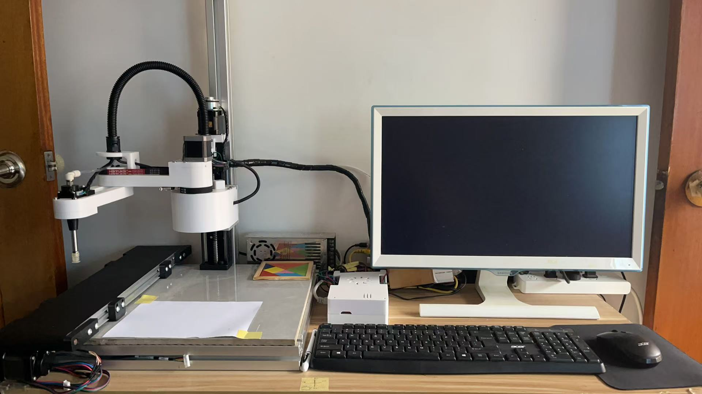

# SCARA 机械臂

## 简介

SCARA 机械臂，适用于个人创作、小型工作室及教育实验等场景。该设备结合了高精度运动控制，能够实现复杂码垛搬运。

## 主要特点

- **操作简便**：通过计算机软件控制，用户界面友好
- **安全保护**：配备紧急停止按钮和防护装置，确保操作安全
- **紧凑设计**：桌面级尺寸，适合空间有限的工作环境

## 技术规格

- 工作区域：150 mm × 150 mm
- 支持格式：标准G代码等
- 连接方式：百兆网 / USB / Wi-Fi

## 应用场景

- 七巧板搬运
- 教学演示与实验
- 小批量定制生产
