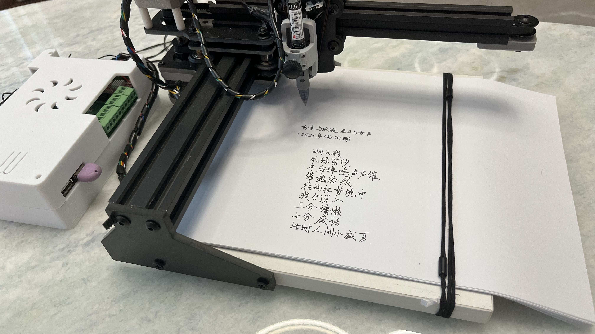

# 智能写字机

## 一、产品概述

智能写字机是一款高精度、自动化的书写设备，能够模拟人类手写效果，实现批量文档书写、个性化贺卡制作、书法作品复制等多种功能。它采用先进的运动控制技术，配合高精度机械结构，能够在各种纸张上实现流畅自然的书写效果。

## 二、产品特点

### 2.1 高精度书写

- 采用高精度步进电机驱动，定位精度可达0.1mm
- 支持多种笔型（钢笔、圆珠笔、马克笔等）
- 可调笔压，适应不同纸张和书写需求
- 支持多种字体和字号，模拟真实手写效果

### 2.2 智能控制

- 内置高性能控制器，支持离线书写
- 支持Wi-Fi/蓝牙连接，可通过手机/电脑远程控制
- 支持多种文件格式导入（TXT、Word、PDF等）
- 智能识别手写体，支持书法作品复制

### 2.3 灵活高效

- 支持A4及以下尺寸纸张
- 自动进纸功能，支持连续书写
- 支持多色笔切换，实现彩色书写
- 书写速度可调，最高可达100字符/分钟

### 2.4 易用性强

- 配备直观的触摸屏操作界面
- 支持图形化路径规划，所见即所得
- 提供丰富的模板库，满足不同场景需求
- 支持固件在线升级，持续优化功能

## 三、技术参数

| 参数项 | 规格 |
|--------|------|
| 有效书写面积 | 210mm × 297mm (A4) |
| 定位精度 | ±0.1mm |
| 重复定位精度 | ±0.05mm |
| 最大书写速度 | 100字符/分钟 |
| 笔压调节范围 | 50g - 500g |
| 支持笔型 | 钢笔、圆珠笔、马克笔（直径6-10mm） |
| 连接方式 | Wi-Fi、蓝牙、USB |
| 供电电压 | DC 12V/2A |
| 功耗 | 待机≤5W，工作≤15W |
| 工作温度 | 0～40℃ |
| 工作湿度 | 20%～80%无凝露 |
| 尺寸 | 350mm × 300mm × 150mm |
| 重量 | 约3.5kg |

## 四、应用场景

- **办公自动化**：批量书写信封、邀请函、感谢信等
- **个性化礼品**：定制贺卡、情书、生日祝福等
- **教育领域**：自动书写练习册、试卷批改、教案书写等
- **文化传承**：书法作品复制、古籍修复、碑刻拓本复制等
- **商业宣传**：定制笔记本、宣传册、名片等
- **家庭使用**：家庭留言、儿童教育、菜谱书写等

## 五、使用说明

### 5.1 快速入门

1. 开箱检查：确保设备、电源适配器、笔架、测试笔等配件齐全
2. 连接电源：使用提供的电源适配器连接设备
3. 安装笔具：根据需要选择合适的笔具，安装到笔架上
4. 开机设置：打开设备电源，通过触摸屏进行基本设置
5. 导入内容：通过Wi-Fi/蓝牙或USB导入需要书写的内容
6. 放置纸张：将纸张平整放置在书写平台上
7. 开始书写：点击开始按钮，设备将自动完成书写

### 5.2 注意事项

- 使用前请确保设备放置平稳，避免震动
- 定期清理导轨和丝杆，保持设备清洁
- 使用合适的笔具，避免使用过于尖锐或粗重的笔
- 避免在潮湿、多尘或极端温度环境下使用
- 长期不使用时，请关闭电源并妥善保管

## 六、技术支持

### 6.1 文档支持

- 提供详细的用户手册和快速入门指南
- 提供常见问题解答和故障排查手册
- 提供视频教程和操作演示

### 6.2 在线支持

- 技术支持邮箱：support@example.com
- 技术支持电话：400-123-4567
- 工作日：9:00-18:00
- 技术支持QQ群：123456789

### 6.3 售后服务

- 提供1年整机质保服务
- 提供终身技术支持
- 支持设备维修和升级
- 提供配件更换服务
  

