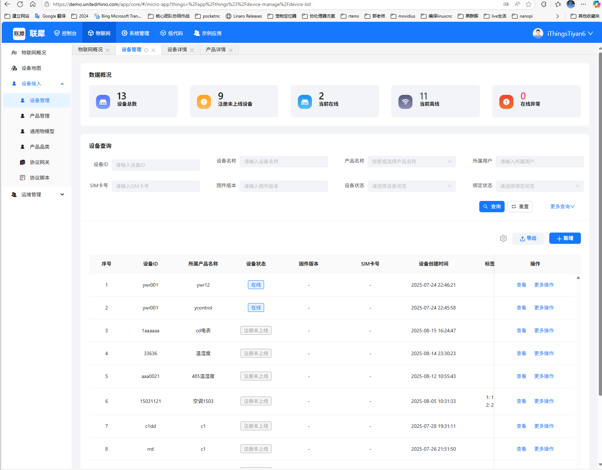
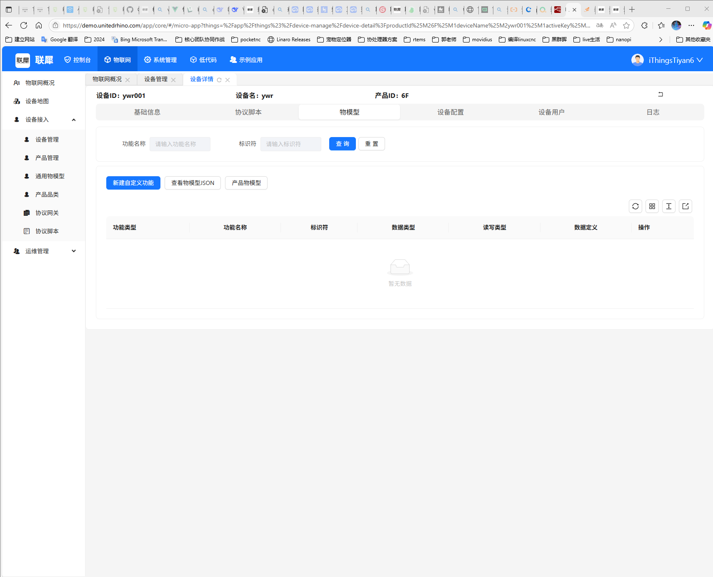
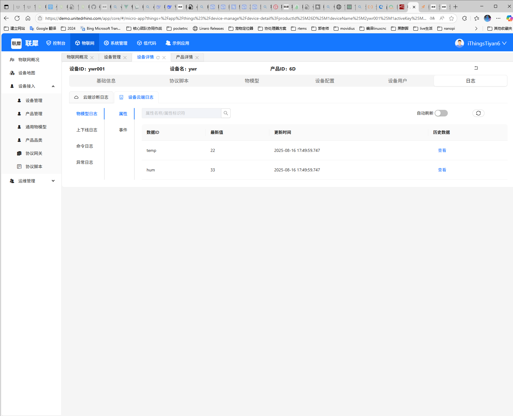
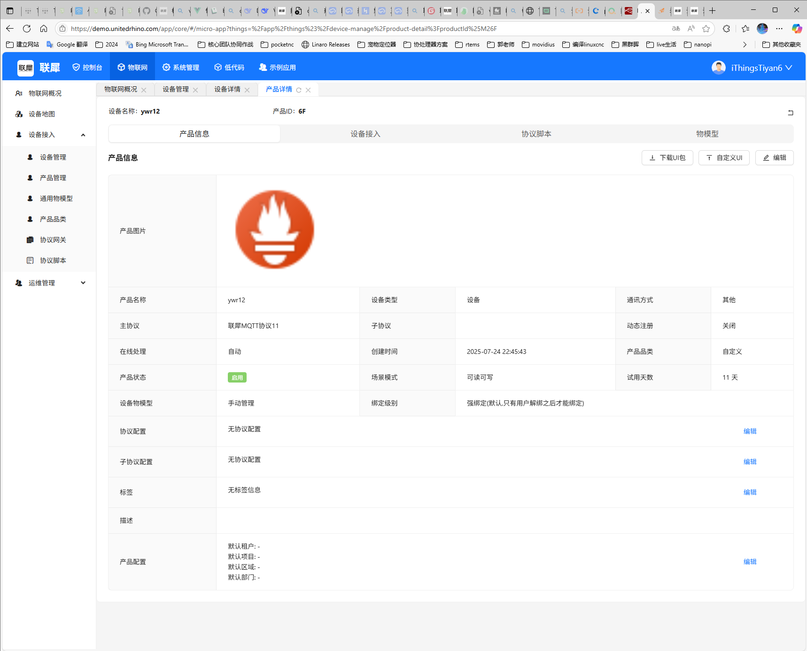
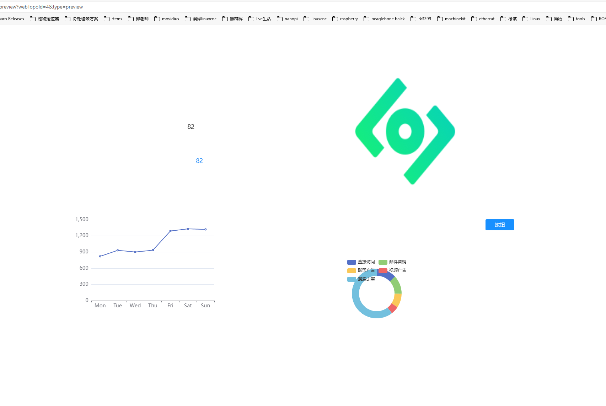
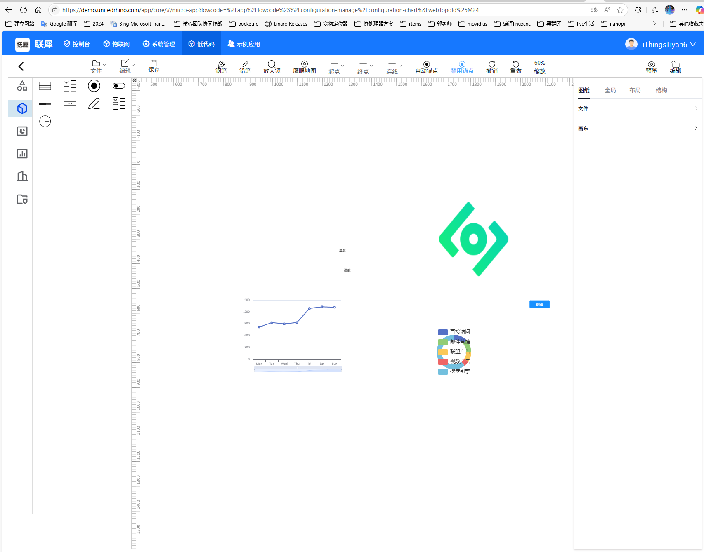
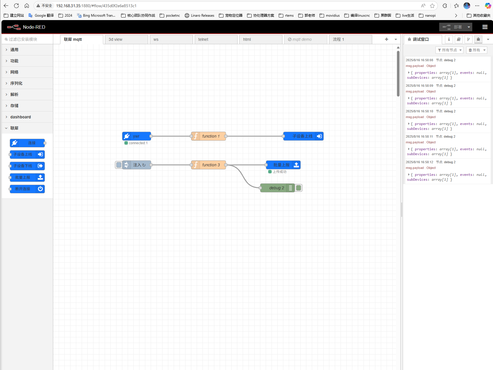
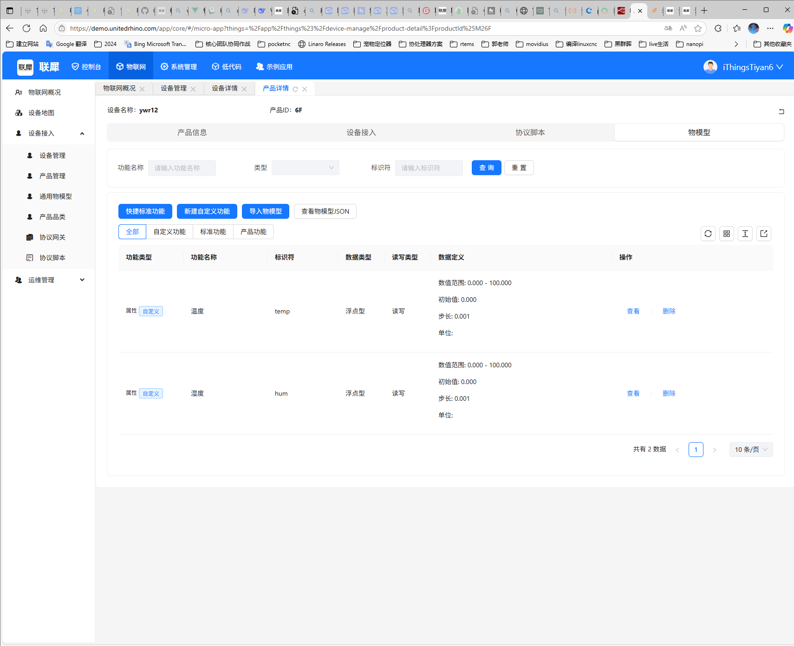
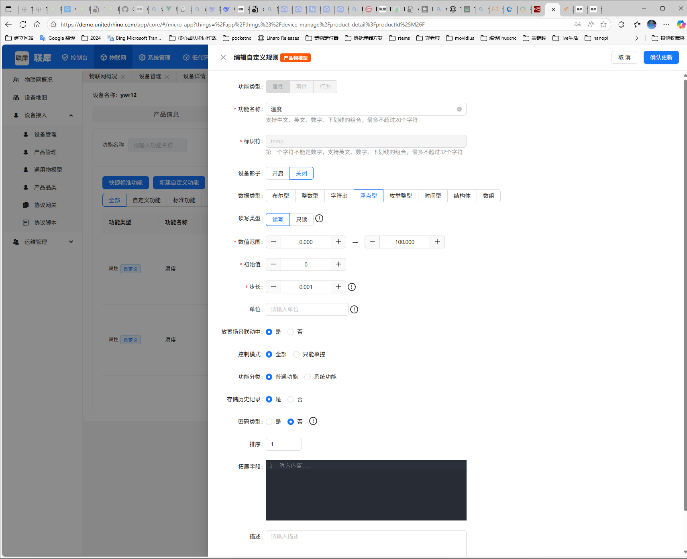

# iThings 物联网平台

iThings 是一个功能强大的物联网平台，提供设备管理、数据收集、规则引擎等完整的物联网解决方案。

## 功能特点

- **设备管理**：轻松注册、监控和管理各类物联网设备
- **数据采集**：实时收集和存储设备数据
- **规则引擎**：基于规则的自动化数据处理和响应
- **可视化界面**：直观的Web界面，便于操作和监控
- **灵活集成**：支持多种通信协议和第三方系统集成

## 系统架构

iThings 平台由以下核心组件构成：

### 1. 设备连接层

负责处理设备的接入和通信，支持多种协议如MQTT、CoAP等。

### 2. 设备管理

提供设备的全生命周期管理，包括注册、配置、升级和监控。

### 3. 网关服务

作为边缘计算节点，处理本地数据并与云平台通信。

### 4. 子设备管理

支持层级化的设备管理，适用于复杂的物联网部署场景。

## 快速开始

### 设备接入

1. 登录iThings平台
2. 在设备管理页面点击"新增"按钮
3. 填写设备信息并提交
4. 按照指引完成设备连接配置

### 数据监控

1. 在设备详情页面查看实时数据
2. 使用数据图表分析历史趋势
3. 设置数据告警规则

### 规则引擎配置

iThings 集成了强大的规则引擎，可以基于设备数据触发自动化动作：

### Node-RED 集成

通过Node-RED可以快速构建自定义的物联网应用：

## 温度湿度传感器示例

以温度湿度传感器为例，展示设备配置和数据监控：

## 技术支持

如有问题或需要帮助，请联系技术支持团队。