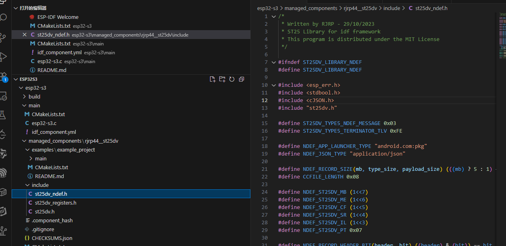
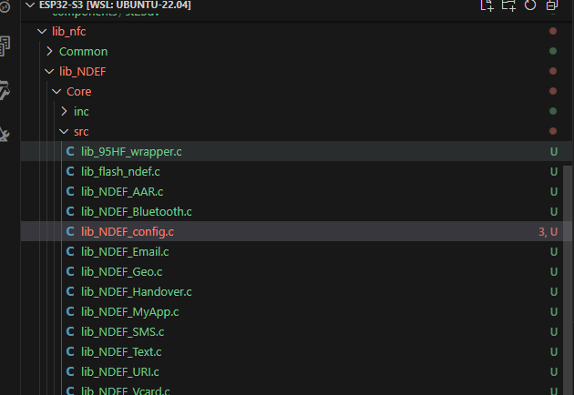
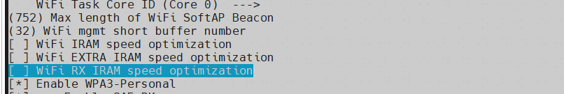

# 拉取 espressif/idf 的docker 镜像
```sh

docker pull docker-hub.dahuatech.com/espressif/idf:latest
```
```sh
docker run -it  -v $PWD:/project -u $UID  -e HOME=/tmp  docker.1ms.run/espressif/idf:latest

```

docker run：运行 Docker 镜像。此为 docker container run 命令的缩写形式。

--rm：构建完成后删除相应容器。

-v $PWD:/project：将主机当前目录 ($PWD) 挂载为容器中的 /project 目录。

-w /project：使 /project 成为当前命令的工作目录。

-u $UID：以当前用户的 ID 运行命令，使文件以当前用户而非 root 用户的身份创建。

-e HOME=/tmp：为用户提供一个主目录，用于将 idf.py 创建的临时文件保存在 ~/.cache 中。

espressif/idf：使用标签为 latest 的 Docker 镜像 espressif/idf。未指定标签时，Docker 会隐式添加 latest 标签。

idf.py build：在容器内运行此命令。


# 新建工程

```sh
idf.py create-project esp32-s3

cd esp32-s3/
idf.py set-target esp32s3
```


# 添加 component 
```sh
# idf.py add-dependency "espp/st25dv^1.0.9"
idf.py create-manifest


idf.py create-manifest --component=my-component 在 components 目录下，为组件 my_component 创建清单文件

```
```sh
dependencies:
  idf:
    version: '>=5.0'
  espp/base_component: 
    version: ">=1.0"
    path: "../base_component"
```
https://github.com/fmtlib/fmt.git


# 修改 
  需要添加i2c 支持
 ## IDF Component Manager Manifest File
dependencies:
  ## Required IDF version
  idf:
    version: ">=4.1.0"
  espp/st25dv:
    version: ">=1.0.9"
  espp/i2c:
    version: ">=1.0.9"
同时外层cmake 需添加

project(esp32-s3)
set(CMAKE_CXX_STANDARD 20)
同时主函数的文件用.cpp


另一个库
改成
#include<CJSON.h>


# 添加自己的组件
```sh
idf.py -C components create-component st25dv

```

``` sh
配置 libnfc
lib_NDEF_config.c 文件中 适配 nfctag.c实现的驱动


```

注意点
使用xTaskCreate 创建 任务 任务函数必须有while(1) 否则程序会崩溃

设置 nfc时 验证密码去设置

```sh
    NFC04A1_NFCTAG_ReadI2CSecuritySession_Dyn(NFC04A1_NFCTAG_INSTANCE, &i2csso);
    if (i2csso == ST25DV_SESSION_CLOSED)
    {
        /* if I2C session is closed, present password to open session */
        passwd.MsbPasswd = 0;
        passwd.LsbPasswd = 0;
        NFC04A1_NFCTAG_PresentI2CPassword(NFC04A1_NFCTAG_INSTANCE, passwd);
    }

    /* Energy harvesting activated after Power On Reset */
    NFC04A1_NFCTAG_WriteEHMode(NFC04A1_NFCTAG_INSTANCE, ST25DV_EH_ACTIVE_AFTER_BOOT);
    NFC04A1_NFCTAG_SetEHENMode_Dyn(NFC04A1_NFCTAG_INSTANCE);

```

添加 app_wifi  添加components所需组件
```CMakeLists.txt
idf_component_register(SRCS "app_wifi.c"
                    INCLUDE_DIRS "include"
                    REQUIRES "driver"
                    "esp_wifi")
```


使用本地下载的 components

```sh


## IDF Component Manager Manifest File
dependencies:
  ## Required IDF version
  idf:
    version: ">=4.1.0"
  espressif/button:
    version: ">=1.0.0"
    override_path: "../components/button"
  espressif/cmake_utilities:
    version: ">=1.0.0"
    override_path: "../components/cmake_utilities"

第二个例子
dependencies:
  cmake_utilities:
    version: '>=1.0.0'
    override_path: "../cmake_utilities"
  idf: '>=4.0'
description: GPIO and ADC and Matrix button driver
documentation: https://docs.espressif.com/projects/esp-iot-solution/en/latest/input_device/button.html
issues: https://github.com/espressif/esp-iot-solution/issues
repository: git://github.com/espressif/esp-iot-solution.git
repository_info:
  commit_sha: 3339788bc154632d7cd8e37bd4b1a83155835eee
  path: components/button
url: https://github.com/espressif/esp-iot-solution/tree/master/components/button
version: 4.1.3


```
freertos 
事件组

```c
创建事件组
EventGroupHandle_t xCreatedEventGroup;
    xCreatedEventGroup = xEventGroupCreate();
    if(xCreatedEventGroup == NULL)
    {
      ESP_LOGE(ST25DVTAG, "创建事件组失败");
    }
 发送事件
    xEventGroupSetBits(xCreatedEventGroup, BIT_0);
    等待事件

        EventBits_t uxBits = xEventGroupWaitBits(xCreatedEventGroup,BIT_1,pdTRUE, pdFALSE,portMAX_DELAY);     

```


```c


依赖于硬件目标的 sdkconfig 默认值
当且仅当 sdkconfig.defaults 文件存在时，构建系统还将尝试从 sdkconfig.defaults.TARGET_NAME 文件中加载默认值，其中 IDF_TARGET 的值为 TARGET_NAME。例如，对于 esp32 这个目标芯片，sdkconfig 的默认值会首先从 sdkconfig.defaults 获取，然后再从 sdkconfig.defaults.esp32 获取。当没有通用的默认设置时，仍需创建一个空的 sdkconfig.defaults 文件，以便构建系统可以识别任何其他与目标芯片相关的 sdkconfig.defaults.TARGET_NAME 文件。

如果使用 SDKCONFIG_DEFAULTS 覆盖默认文件的名称，则硬件目标的默认文件名也会从 SDKCONFIG_DEFAULTS 值中派生。如果 SDKCONFIG_DEFAULTS 中有多个文件，硬件目标文件会在引入该硬件目标文件的文件之后应用， 而 SDKCONFIG_DEFAULTS 中所有其它后续文件则会在硬件目标文件之后应用 。

例如，如果 SDKCONFIG_DEFAULTS="sdkconfig.defaults;sdkconfig_devkit1"，并且在同一文件夹中有一个 sdkconfig.defaults.esp32 文件，那么这些文件将按以下顺序应用：（1) sdkconfig.defaults (2) sdkconfig.defaults.esp32 (3) sdkconfig_devkit1。

````
sdkconfig.default.esp32s3
```sh
使用蓝牙 时使用 idf.py menuconfig 命令 开启蓝牙
# This file was generated using idf.py save-defconfig. It can be edited manually.
# Espressif IoT Development Framework (ESP-IDF) Project Minimal Configuration
#
# CONFIG_IDF_TARGET="esp32s3
CONFIG_BT_ENABLED=y
# CONFIG_BT_BLE_50_FEATURES_SUPPORTED is not set
CONFIG_BT_BLE_42_FEATURES_SUPPORTED=y

同时还需要 sdkconfig.defaults

# Override some defaults so BT stack is enabled
# in this example

#
# Partition Table
# (It's possible to fit Blufi in 1MB app partition size with some other optimizations, but
# default config is close to 1MB.)
CONFIG_PARTITION_TABLE_SINGLE_APP_LARGE=y

#
# BT config
#
CONFIG_BT_ENABLED=y
CONFIG_BT_GATTC_ENABLE=n
CONFIG_BT_BLE_SMP_ENABLE=n
CONFIG_BT_BLE_BLUFI_ENABLE=y
CONFIG_MBEDTLS_HARDWARE_MPI=n
CONFIG_MBEDTLS_DHM_C=y

```
每次重新配置sdconfig 删除 sdkconfig 和build目录


当启用了bluefi后 内部ram的IRAM是内部RAM
当我使用wifi+ble+ASR组成的一个工程时，编译后出现Section .iram0.text will not fit in region iram0_0_seg的错误，原因是IRAM的内存空间仍然不够，这是因为任务堆栈等数据是不能存放在外部RAM中的，所以IRAM中的内存依然紧张。

具体步骤如下：
idf.py menuconfig->component config->Wi-Fi,将箭头所指的两项按n取消选择
这两项是将wifi的部分实现放在 IRAM中，这样IRAM的内存空间就紧张了。


<!-- idf.py docs -sp api-guides/performance/size.html#reducing-overall-size
 -->


 之后下载分区位置变了
 ```sh

 python -m esptool --chip esp32 -b 460800 --before default_reset --after hard_reset write_flash --flash_mode dio --flash_size 16MB --flash_freq 40m 0x0 build/bootloader/bootloader.bin 0x8000 build/partition_table/partition-table.bin 0x10000 build/esp32-s3.bin
 变为
 python -m esptool --chip esp32 -b 460800 --before default_reset --after hard_reset write_flash --flash_mode dio --flash_size 16MB --flash_freq 40m 0x1000 build/bootloader/bootloader.bin 0x8000 build/partition_table/partition-table.bin 0x10000 build/esp32-s3.bin

 ```
 新建分区表partitions.csv


 idf.py save-defconfig
 将配置保存到sdkconfig.defaults.


 已知问题 st25dv i2c速率太低会有问题导致
 传输卡住只传200字节
 NVS存储学习


 非易失性存储（NVS）适用于需要处理大量键值对的应用场景，如应用系统配置。为了方便使用，
 键空间被划分为多个命名空间，每个命名空间是一个独立的存储区域。除了支持基本的数据类型（最大支持 64 位整数），
 NVS 还支持零终止字符串和长度可变的二进制大对象数据 (blob)。
 ```c

nvs_handle_t my_handle;
// Open NVS handle
nvs_open("storage", NVS_READWRITE, &my_handle);

 ```
 在 main中打印 5000的数组导致  app_main 栈溢出
 ```c
 
***ERROR*** A stack overflow in task main has been detected.


Backtrace: 0x40375b15:0x3fc9bb80 0x4037b195:0x3fc9bba0 0x4037bf76:0x3fc9bbc0 0x4037d173:0x3fc9bc40 0x4037c03c:0x3fc9bc60 0x4037c032:0x3fc9bc80 0x42013c01:0x000001f4 |<-CORRUPTED

```

调用命令 idf.py size 可查找静态分配内存大小。
main 函数中申请了一个局部变量     picture_data picture_data_read; 5000字节 导致栈溢出


rbwcon.py 
将彩色图片转化位散点图
正常的图片应该向左旋转一下，上下垂直的图片 变为左右垂直再
调用 rbwcon.py 将图片转换为散点图
之后使用 ImageToEpd v4.2 生成 .c的数组